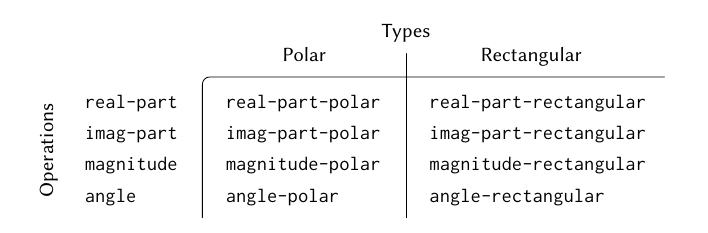

# Chapter 2

# Building Abstractions with Data

**Closure property** - the ability to create data objects whose elements are data objects themselves.

### Data-Directed Programming

A means for **modularizing** the system design. Data-directed programming works by **dispatching on a type**.

Data-directed programming is the technique of designing programs to work with such a table directly.

To install new object representation packages we do not need to modify the existing code, we only need to add new entries to the table.

#### Message Passing

Similar to DDP, but instead of **dispatching on type**, it works by **dispatching** on operation names.

**Coercion**

**Hierarchies of Types**

---
## Main Takeaway

Abstracting your programs with data is a very powerful technique that allows a programmer to efficiently scale his programs. Generalization of procedures is important.

If you struggle with choosing a starting point for designing your program, try starting from the top with the assumption that the lower levels are already in place. This way you can work with an abstraction, not having to worry about the particular implementation of it and solely focus on that part of the program which you are designing right now.
